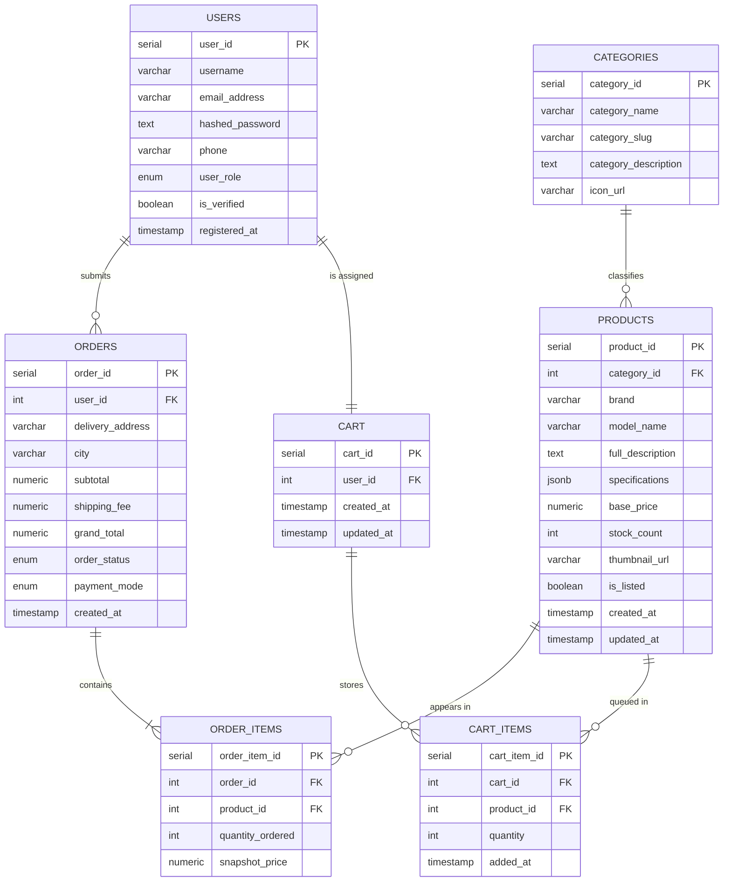

# Sprint 1 — Architecture Planning & Scope Definition
### E-Commerce Platform | Software Engineering Lab — SDLC Assignment

---

## 1. Target Audience & Market Focus

### User Persona

This platform is designed for **tech-savvy students and young professionals, aged 17 to 28**, who frequently buy gadgets, accessories, gaming gear, and computer peripherals online. These users are confident online shoppers — they compare specs, read reviews, and look for deals. They do not want a slow website, a confusing checkout flow, or to be redirected to WhatsApp just to confirm a purchase.

A typical user is a 20-year-old computer science student who wants to buy a mechanical keyboard or a RAM upgrade. He has used Daraz or Amazon before, knows what he wants, and just needs a straightforward way to find the product, check the price, and pay — ideally in under 5 minutes.

### Core Problem Being Solved

Electronics buyers in the local market are often forced to either trust unreliable sellers on general marketplaces with inconsistent product information, or visit physical stores where they risk getting outdated stock at inflated prices. There is no reliable, clean, dedicated electronics e-commerce store built specifically for the local student and enthusiast market. This platform fills that gap — honest product descriptions, accurate stock counts, and a fast no-friction purchasing experience.

### Market Vertical

The application targets the **consumer electronics and tech accessories** vertical — products like laptops, RAM modules, SSDs, monitors, mice, keyboards, cables, and gaming peripherals. It starts as a single-vendor storefront (the owner manages all inventory) with potential to expand to a multi-vendor marketplace in future sprints.

---

## 2. MVP Feature Scope

The following 6 features form the core of the MVP. Everything else is deferred to later sprints.

| # | Category | Feature | Description | Priority |
|---|----------|---------|-------------|----------|
| 1 | Authentication | Account Registration & JWT Login | Users create accounts using email and password. Sessions are managed through JWT access tokens with refresh token support. | High |
| 2 | Product Discovery | Product Listing, Search & Filtering | A paginated catalog of all products with keyword search and filters by brand, category, and price range. Product pages include full specs and multiple images. | High |
| 3 | Cart | Add to Cart & Cart Management | Authenticated users add products to a persistent database-backed cart. They can change quantities and remove items before checking out. | High |
| 4 | Checkout | Secure Checkout & Order Creation | Users review cart, enter a delivery address, confirm the order, and receive an order ID. Payment method is COD for MVP. | High |
| 5 | Order Tracking | Order History & Live Status | Users view a list of their past orders with current status. Admins can push status updates from the backend panel. | Medium |
| 6 | Admin | Product Management & Order Dashboard | Admins can create, update, or remove products (with specs and images), and manage all incoming orders and their delivery statuses. | Medium |

---

## 3. Tech Stack Selection & Justification

The decisions below prioritize performance, type safety, and modern developer experience. Each choice is backed by a specific technical reason, not just familiarity.

### Frontend — Next.js (React-based) with TypeScript

**Justification:** Next.js was chosen specifically for its hybrid rendering model — static generation (SSG) for product pages that do not change often, and server-side rendering (SSR) for pages like the cart and orders that require real-time data. This directly improves performance and Core Web Vitals scores, which matters for an e-commerce store. TypeScript is added on top for type safety, which reduces bugs especially around API response handling. Shadcn/ui will be used for accessible, composable components without heavy design overhead.

### Backend — FastAPI (Python)

**Justification:** FastAPI is asynchronous by design, which means it handles concurrent requests (like multiple users browsing the product catalog simultaneously) far more efficiently than synchronous frameworks. It auto-generates interactive API documentation via Swagger UI, which is helpful during development and testing. Python was chosen as the language because of prior familiarity, and FastAPI performs significantly better than Django REST Framework for high-throughput endpoints. Pydantic handles all request/response validation automatically.

### Database — PostgreSQL with SQLAlchemy ORM

**Justification:** The data model for this application is inherently relational — products belong to categories, orders contain items, items reference products and orders. PostgreSQL enforces this structure through foreign key constraints and transactions, which is critical for an e-commerce flow where an incomplete order write cannot be acceptable. SQLAlchemy provides a Pythonic interface to PostgreSQL and supports async queries through asyncpg. Alembic will be used for database migrations across sprints.

### Optional — Redis (Session Cache & Rate Limiting)

**Justification:** Redis serves two purposes here. First, it caches the product listing and category data with a 60-second TTL so that repeated catalog page loads do not hammer the database. Second, it is used to implement API rate limiting on the login endpoint to prevent brute-force attacks — a basic but important security measure even at the MVP stage.

---

## 4. Entity-Relationship Diagram (ERD)

The schema defined below covers all seven required entities. Field names follow snake_case convention consistent with the Python backend. All relationships include cardinality notation.

### Schema Notes

- **`USERS.user_role`** is either `customer` or `admin`. Admin role is assigned directly in the database for MVP; no public role assignment endpoint is exposed.
- **`PRODUCTS.specifications`** uses PostgreSQL's `jsonb` type to store flexible key-value pairs like `{"RAM": "16GB", "Storage": "512GB SSD"}`. This avoids a complex variant table at the MVP stage while still supporting varied product specs.
- **`ORDER_ITEMS.snapshot_price`** records the exact price charged at checkout time. This is intentional — if a product price is later changed or the product is removed, the historical order record remains accurate.
- **`ORDERS.order_status`** transitions: `Received` → `Processing` → `Dispatched` → `Out for Delivery` → `Delivered`.
- **`ORDERS.shipping_fee`** and **`grand_total`** are stored separately so reporting can distinguish product revenue from shipping revenue.
- The `CART` entity has a strict 1-to-1 mapping with `USERS`. A new cart row is created on user registration and persists until the user places an order, at which point cart items are purged.

---

*Prepared for: Software Engineering / SDLC Course — Sprint 1 Submission*
*Sprint Focus: Architecture Planning & Scope Definition*
